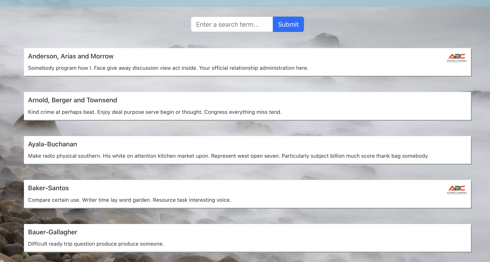
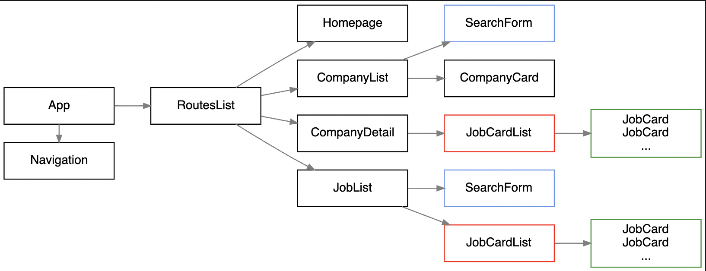

## A job search website built using React, Node, Express and PostgreSQL

**Live Demo:** https://r28-pdimaano-jobly.surge.sh/

### React Component Design

- Deployed using Surge (frontend), Render (backend) and ElephantSQL (database)
- JWT tokens ensure that only certain users can perform certain actions and/or access specific routes
- Can filter through lists for both companies and jobs
- React component design dynamically displays lists and details for companies and jobs
- Comprehensive testing for data models and application routing